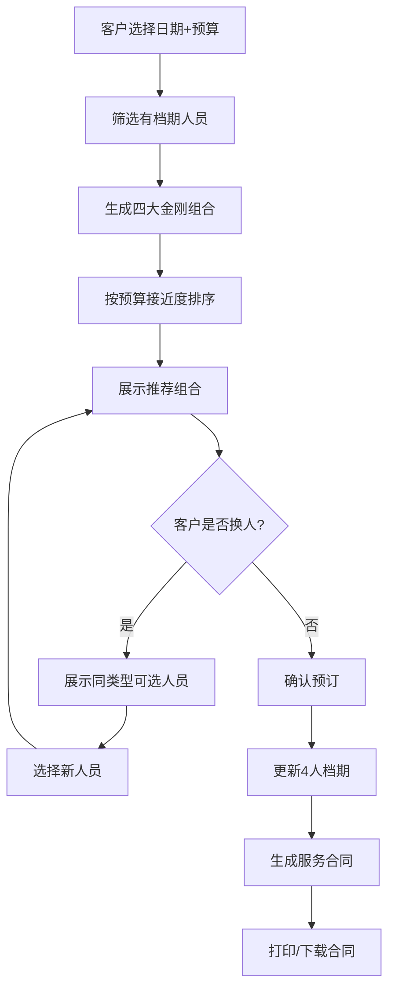

## 1. 产品概述

婚庆公司四大金刚（司仪、摄影、摄像、化妆师）档期管理与智能推荐系统，为客户提供一站式婚礼服务人员筛选、智能推荐和预订管理功能，同时为销售团队提供档期导出和冲突检测工具。

- 解决问题：婚庆公司人员档期分散管理、客户选人选配效率低、档期冲突频发
- 目标用户：婚庆公司客户（选人选配）、销售人员（档期管理、推销）
- 产品价值：提升客户选配体验、减少人工调度错误、提高销售转化率

## 2. 核心功能

### 2.1 用户角色
| 角色 | 使用方式 | 核心权限 |
|------|----------|----------|
| 客户 | 前端界面操作 | 选择日期预算、查看推荐、换人、确认预订 |
| 销售/管理员 | 前端界面操作 | 手动录入预订、导出档期、查看合同、冲突检测 |

### 2.2 功能模块
1. **智能推荐页**：日期预算选择、推荐组合展示、换人操作、预订确认
2. **档期管理页**：人员列表展示、手动录入预订、档期冲突检测、已预订列表
3. **合同生成页**：客户信息录入、合同预览、打印/导出
4. **数据导出页**：未预订档期一览表导出（Excel）

### 2.3 页面详情
| 页面名称 | 模块名称 | 功能描述 |
|-----------|-------------|---------------------|
| 智能推荐页 | 条件筛选区 | 婚礼日期选择器、预算范围滑块/输入框、开始推荐按钮 |
| 智能推荐页 | 推荐结果区 | 四大金刚卡片（司仪/摄影/摄像/化妆）、换人按钮、总价显示、预算匹配度、预订确认按钮 |
| 智能推荐页 | 换人弹窗 | 同类型人员列表（满足日期和预算约束）、星级/价格展示、选择按钮 |
| 档期管理页 | 人员概览 | 按类型分组展示32位人员、实时档期状态、颜色标识 |
| 档期管理页 | 预订录入 | 人员选择、日期输入、客户信息、冲突检测（红色警告）、保存按钮 |
| 档期管理页 | 已预订列表 | 所有预订记录展示、按日期/人员筛选 |
| 合同生成页 | 合同模板 | 客户信息、婚礼日期、人员清单（姓名/类型/星级/价格）、总价、条款区域 |
| 合同生成页 | 操作区 | 客户信息表单、预览合同、打印/下载按钮 |
| 数据导出页 | 导出控制 | 日期范围选择、人员类型筛选、导出Excel按钮 |
| 数据导出页 | 档期预览 | 未预订档期表格预览（日历视图或列表视图） |

## 3. 核心流程

### 3.1 客户智能推荐流程
客户进入首页 → 选择婚礼日期和预算范围 → 点击"智能推荐" → 系统筛选当天有档期的人员 → 生成所有可能的四大金刚组合 → 按总价与预算差值排序 → 展示最优推荐组合 → 客户可对任意人员点击"换人" → 弹出同类型可选人员列表 → 选择新人员后更新组合 → 客户确认预订 → 系统更新4位人员的档期 → 跳转至合同生成页 → 录入客户信息 → 生成合同 → 打印/下载

### 3.2 销售手动录入流程
销售进入档期管理页 → 选择人员类型和具体人员 → 输入预订日期和客户信息 → 系统进行档期冲突检测 → 若冲突显示红色警告并拒绝保存 → 若无冲突则保存并更新档期 → 显示成功提示

### 3.3 Mermaid 流程图

## 4. 用户界面设计

### 4.1 设计风格
- **主色调**：玫瑰金渐变（#D4A574 → #E8C4A0），搭配香槟白（#FFF8F0）和深棕（#3D2914），营造婚礼浪漫典雅氛围
- **辅助色**：正红（#C9184A）用于警告和重点强调，森林绿（#2D6A4F）用于成功状态
- **按钮风格**：圆角矩形（12px），主按钮使用玫瑰金渐变+微阴影，悬停有上浮+光晕效果
- **字体**：标题使用 'Playfair Display'（衬线优雅字体），正文使用 'Noto Serif SC'（中文衬线），体现高端婚庆质感
- **布局风格**：卡片式布局，柔和阴影，大量留白，采用不规则网格打破单调
- **图标风格**：线性优雅图标，搭配花卉装饰元素（玫瑰、花环线条元素）

### 4.2 页面设计概述
| 页面名称 | 模块名称 | UI 元素 |
|-----------|-------------|-------------|
| 智能推荐页 | 条件筛选区 | 大幅标题"为您的完美婚礼匹配最佳团队"、居中日期选择器（日历样式）、预算双滑块、金色渐变按钮 |
| 智能推荐页 | 推荐结果区 | 4列卡片布局（司仪🎤/摄影📷/摄像🎥/化妆💄）、卡片内头像+姓名+星级+价格、换人按钮（旋转图标）、底部总价栏（动态高亮）、确认预订按钮（脉冲动画） |
| 智能推荐页 | 换人弹窗 | 半透明遮罩、居中模态框、人员列表（横向滚动）、每人卡片、选择按钮 |
| 档期管理页 | 人员概览 | 4个Tab切换（司仪/摄影/摄像/化妆）、网格人员卡片、绿色圆点=空闲/红色圆点=已占、悬停显示档期详情 |
| 档期管理页 | 预订录入 | 表单布局、下拉选择人员、日期选择器、客户姓名/电话输入、保存按钮、红色警告横幅（冲突时） |
| 合同生成页 | 合同模板 | A4纸效果容器、页眉公司Logo+名称、合同表格、签名区、打印按钮 |
| 数据导出页 | 导出控制 | 日期范围选择器、类型多选框、导出按钮（Excel图标） |

### 4.3 响应式
- 桌面端优先设计（1280px+），推荐区采用4列等宽网格
- 平板端（768-1279px）：推荐区变为2×2网格
- 移动端（<768px）：推荐区变为纵向单列堆叠，预算滑块改为输入框
- 所有弹窗支持触摸滑动，按钮尺寸满足触控友好（≥44px高度）

### 4.4 动效设计
- 页面加载：标题渐入+位移，卡片依次淡入（staggered delay 100ms）
- 换人操作：被替换卡片翻转飞出，新卡片翻转飞入（3D翻转动画）
- 预算匹配：价格接近预算时总价数字有金色光晕脉冲
- 冲突警告：红色横幅从顶部滑入，伴随轻微震动效果
- 悬停效果：卡片轻微上浮（translateY -4px），阴影加深
