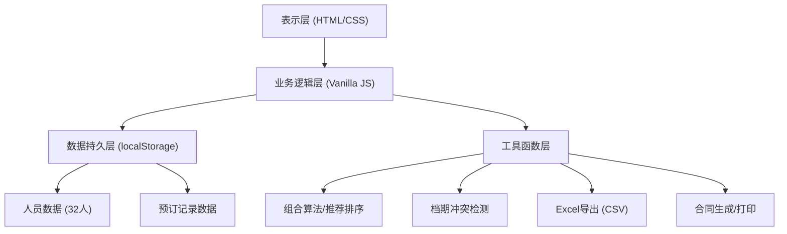
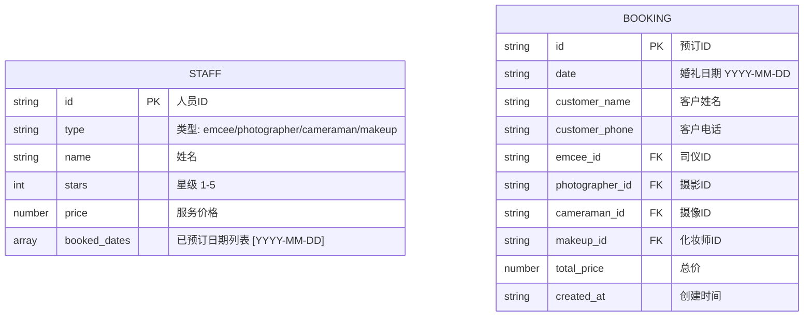

## 1. 架构设计



纯前端单页应用架构，无后端服务。所有数据存储于浏览器 localStorage，业务逻辑在客户端完成。

## 2. 技术描述

- **前端**：原生 HTML5 + CSS3 + JavaScript (ES6+)，无框架依赖
- **数据存储**：localStorage 持久化，初始 Mock 数据内置
- **导出功能**：CSV 格式导出（可被 Excel 打开），不依赖第三方库
- **合同生成**：HTML 模板 + window.print() 打印/PDF导出
- **字体**：Google Fonts - Playfair Display + Noto Serif SC
- **图标**：CSS 绘制 + Unicode 表情符号，不依赖图标库

## 3. 页面结构（单页多视图）

| 视图ID | 对应页面 | 触发方式 |
|-------|---------|---------|
| #view-recommend | 智能推荐页 | 默认视图 / 导航点击"智能推荐" |
| #view-schedule | 档期管理页 | 导航点击"档期管理" |
| #view-contract | 合同生成页 | 预订确认后跳转 / 导航点击"合同管理" |
| #view-export | 数据导出页 | 导航点击"导出档期" |

## 4. 数据模型

### 4.1 数据模型 ER 图


### 4.2 数据结构定义

```javascript
// 人员类型枚举
const STAFF_TYPES = {
  EMCEE: 'emcee',           // 司仪
  PHOTOGRAPHER: 'photographer', // 摄影
  CAMERAMAN: 'cameraman',   // 摄像
  MAKEUP: 'makeup'          // 化妆
};

// 人员数据结构
interface Staff {
  id: string;               // e.g., "emcee_01"
  type: STAFF_TYPES;
  name: string;
  stars: number;            // 1-5
  price: number;            // 服务价格
  bookedDates: string[];    // ['2026-06-20', '2026-07-15']
}

// 预订数据结构
interface Booking {
  id: string;
  date: string;
  customerName: string;
  customerPhone: string;
  emceeId: string;
  photographerId: string;
  cameramanId: string;
  makeupId: string;
  totalPrice: number;
  createdAt: string;
}

// 推荐组合结构
interface RecommendCombo {
  emcee: Staff;
  photographer: Staff;
  cameraman: Staff;
  makeup: Staff;
  totalPrice: number;
  budgetDiff: number;       // 与预算差值（绝对值）
}
```

### 4.3 初始 Mock 数据
- 每种类型 8 人，共 32 人
- 价格范围：司仪 3000-12000，摄影 4000-15000，摄像 5000-18000，化妆 2000-10000
- 星级：随机 1-5 星
- 已预订档期：每人预置 3-8 个随机日期（未来 3 个月内）

## 5. 核心算法

### 5.1 推荐算法
```
输入：日期 date，预算 budget
步骤：
  1. 按类型筛选出 date 当天有档期的人员
     availableEmcees = staff.filter(s => s.type==='emcee' && !s.bookedDates.includes(date))
     同理筛选 photographer/cameraman/makeup
  2. 若任一类型无可用人员，返回"无可用组合"提示
  3. 生成四元组笛卡尔积（所有组合），计算每组总价
  4. 过滤：总价在 budget ± 30% 范围内的组合
  5. 按 |totalPrice - budget| 升序排序
  6. 返回前 20 组结果（避免组合过多）
```

### 5.2 档期冲突检测
```
输入：staffId, date
输出：{ hasConflict: boolean, conflictInfo?: string }
逻辑：
  const staff = staffList.find(s => s.id === staffId)
  if (staff.bookedDates.includes(date))
    return { hasConflict: true, conflictInfo: `${staff.name} 在 ${date} 已有预订` }
  return { hasConflict: false }
```

### 5.3 换人算法
```
输入：当前推荐组合 combo，待替换类型 replaceType，预算 budget，日期 date
步骤：
  1. 获取该类型所有可用人员（date有档期）
  2. 排除当前已选中的人员
  3. 计算替换后新总价：combo.totalPrice - current.price + candidate.price
  4. 按 |newTotalPrice - budget| 升序排序可选人员
  5. 返回候选列表
```

## 6. 功能模块清单

| 模块 | 文件 | 核心函数 |
|-----|------|---------|
| 数据管理 | data.js | initMockData(), getStaffList(), saveBooking(), getBookings() |
| 推荐引擎 | recommend.js | findAvailableStaff(), generateCombos(), sortByBudget(), getReplaceCandidates() |
| 档期检测 | schedule.js | checkConflict(), updateStaffSchedule(), getUnbookedDates() |
| 导出功能 | export.js | exportUnbookedToCSV(), generateCSVContent() |
| 合同生成 | contract.js | renderContractTemplate(), printContract() |
| UI 渲染 | ui.js | renderRecommendView(), renderScheduleView(), renderContractView(), showModal(), hideModal() |
| 事件绑定 | app.js | initEventListeners(), handleRecommend(), handleReplace(), handleConfirmBooking(), handleManualBooking() |
